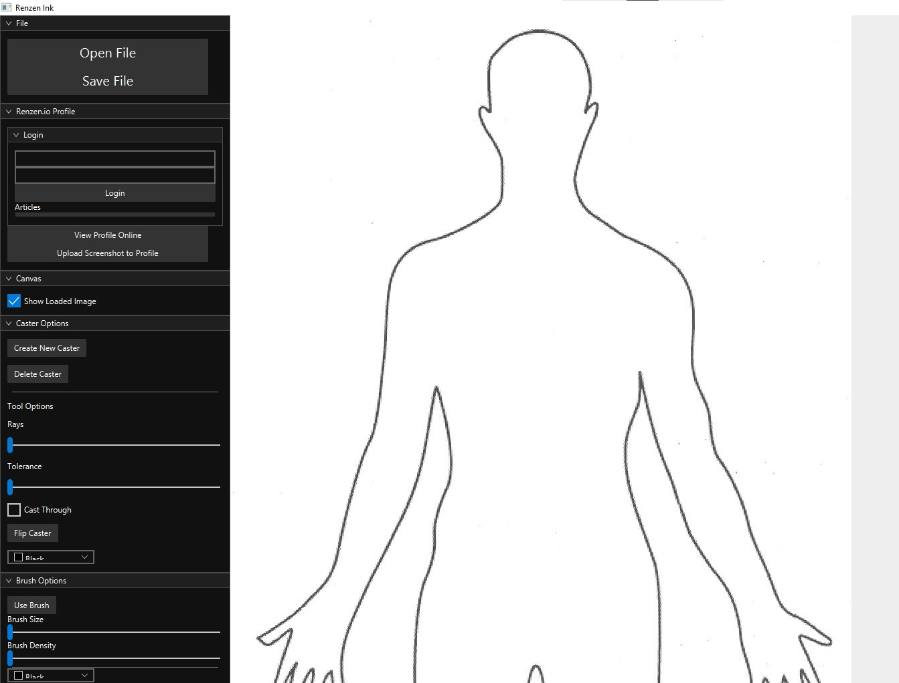
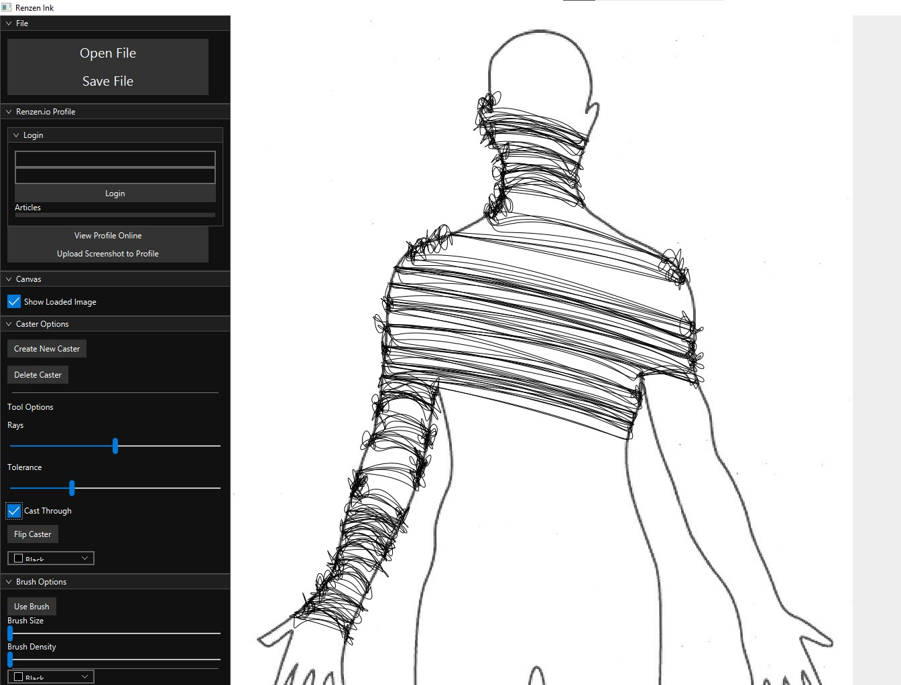
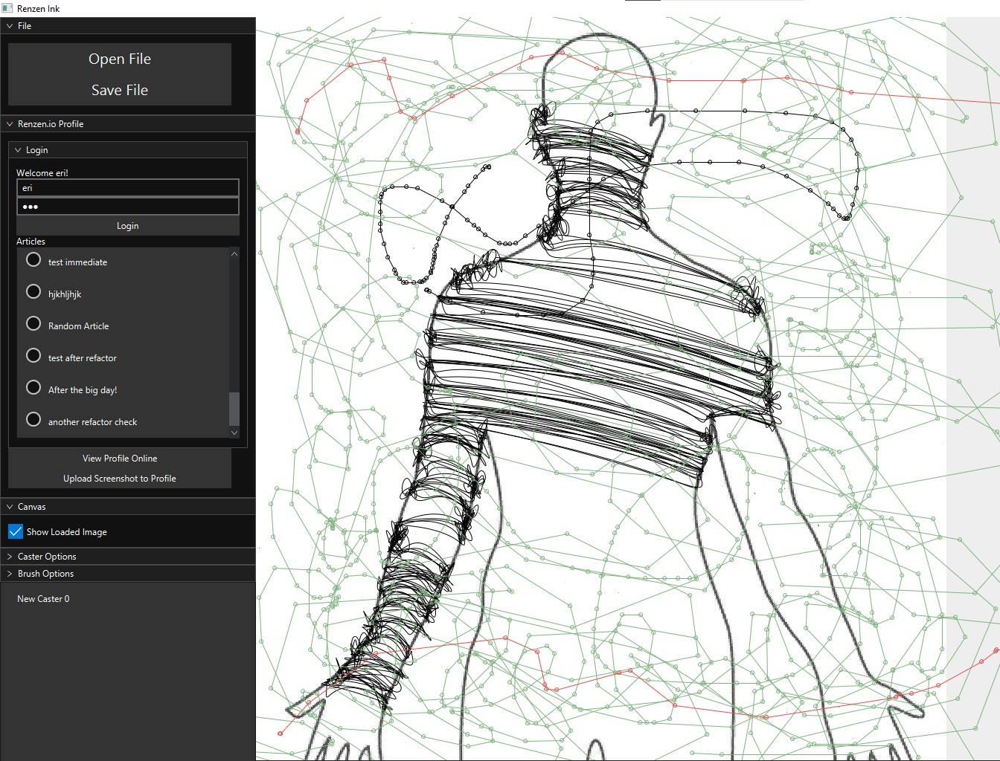
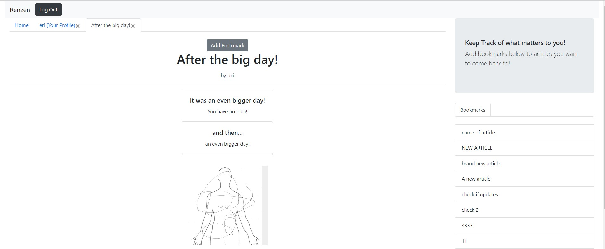
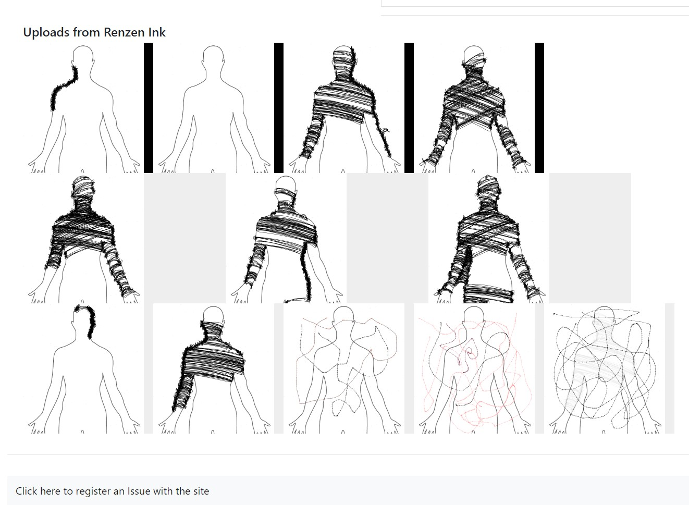

# Renzen Ink
java drawing application (rewrite complete!)

## Description
The focus on this app is on unusual drawing tools. So far I have implemented the "Caster" tool, and a different take on the standard brush found in most drawing apps. Eventually regular and more common drawing tools will also be added to the app.

Renzen is a project that combines a Java art application called Renzen Ink with the website Renzen.io. 

From Renzen Ink you can create artwork, and share it to your friends and communities on Renzen.io. It also allows "streaming works in progress" by allowing a user to add, at any time, a screenshot of their current work to an updated article on their profile and communities.

This allows artists in communities to work together and comment, appreciate, and support other artists throughout their entire artistic process and journey, rather than just uploading a finished product at the end.

The Renzen Ink app uses Spring boot to log into your online profile, and retrieve information about your online Renzen.io profile and personalize your experience. It allows a basic drawing experience at this time, to be further developed. It also has a special tool developed called "Caster" that allows the user quickly create strokes across an outline. More specialty tools like this are in the works. The UI was originally devloped in Swing, but has been ported to JavaFX. It is designed using MVC principles.

Renzen.io is built using Spring Boot on the backend. Microsoft Azure is used extensively to support the site. Azure App Services is used to host the web app, Azure Cosmos DB is used to store the information on the site, and Azure storage is used to store the images on the site. The front end of the website is built in Javascript using React, Bootstrap, and Redux.

## Demonstration

This is the default outline included in the repository

To use the "Caster" tool, you click on "Create New Caster". and then click twice on the screen. These two points will will then create a line.
From this line, The app will generate lines perependicular to it. These lines will then intersect with the outline in the photo.
By default, These lines will then strike the outline, and generate lines between those intersections.

You can also choose "Cast Shade". In this case, the intersected points will continue  through the outline until they strike again.
The app will then generate lines between the two intersections. This allows you to "fill" and outline with strokes.

You can also log into Renzen.io and add screenshots to your profile or add them to an article you've already written. This allows you to have an article that keeps a running stream of your progress on your art to show your friends and communities on the site! (I am not an artist)

