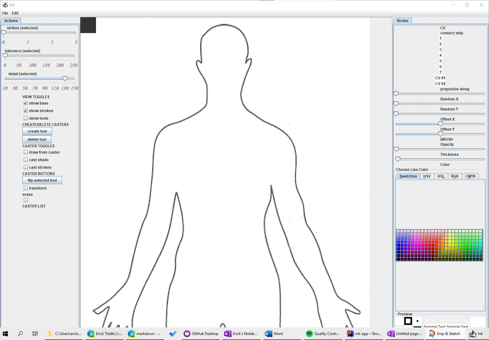
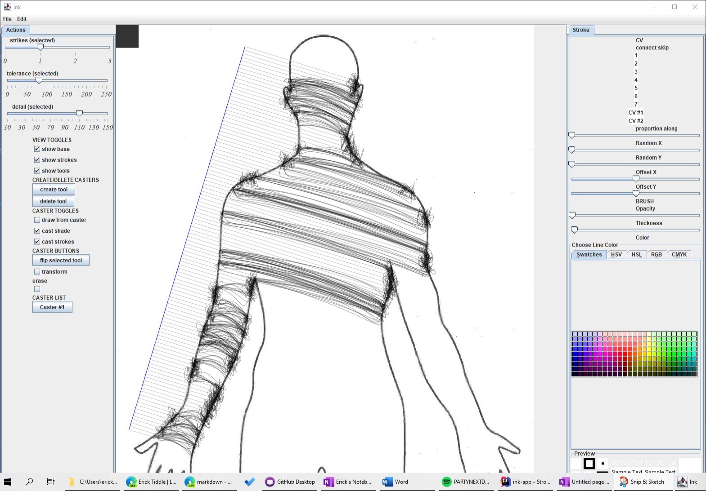
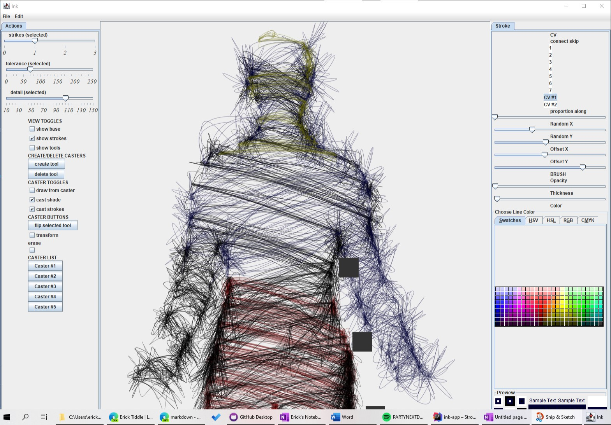

# ink-app
java drawing application (is currently being rewritten)

## Description
This app allows you to Take an outline, and fill in the spaces between them with lines to make a drawing.

## How to use it 
To do this, you click on "Create Tool". and then click twice on the screen. These two points will will then create a line.
From this line, The app will generate lines perependicular to it. These lines will then intersect with the outline in the photo.
By default, These lines will then strike the outline, and generate lines between those intersections.

You can also choose "Cast Shade". In this case, the intersected points will continue  through the outline until they strike again.
The app will then generate lines between the two intersections. This allows you to "fill" and outline with strokes.

There are other options as well.

## Demonstration

This is the default outline included in the repository

We will then use "Create Tool" to create a point for our intersection tests to originate from. We will also change the mode to "Cast Shade"

Playing around with the other options, you can be more creative after this point, and mess around with the line properties and edit them after they are created.

